<div align="center">

  <!-- ================= PREMIUM CUSTOM SVG BANNER ================= -->
  

  <br />

  [](https://git.io/typing-svg)

  <br />

  
  
  
  

</div>

---

# 👋 Hello, I'm Ajinkya Pote

```typescript
class Ajinkya {

name = "Ajinkya Pote";

role = "Senior Software Engineer";

location = "Navi Mumbai, India";

specialization = [
"Backend Engineering",
"Full Stack Development",
"Mobile Applications",
"Cloud Architecture"
];

motto = "Write Clean. Build Smart. Scale Forever.";

}
```

---

# 🚀 About Me

I'm a Senior Software Engineer who enjoys building scalable software that powers real businesses — from backend
architecture and database optimization to polished frontend experiences and cross-platform mobile applications.

My primary focus areas include:

- ⚙ Enterprise Backend Systems
- 🌐 Full Stack Web Applications
- 📱 Android & iOS Development
- ☁ Cloud Infrastructure
- 🚀 DevOps & Automation

---

# 💡 Engineering Philosophy

<table>
  <tr>

    <td width="33%" align="center">

      ### 🏗 Architecture

      Design systems that remain maintainable even years later.

    </td>

    <td width="33%" align="center">

      ### ⚡ Performance

      Every millisecond matters.

    </td>

    <td width="33%" align="center">

      ### 🤝 Teamwork

      Good software is built by great collaboration.

    </td>

  </tr>
</table>

---

# 🛠 Tech Arsenal

<div align="center"> 
    ### 💻 Languages 
    
  ### 🚀 Backend & Web Frameworks 
  ### 🎨 Frontend & UI 
  ### 📱 Mobile Development 
  ### 🤖 AI, ML & Data Science  <br /><br />
  &nbsp;&nbsp; &nbsp;&nbsp; &nbsp;&nbsp; &nbsp;&nbsp;  ### 💾 Databases, Caching & Auth  <br /><br />  ### ☁️ Cloud, DevOps &
  Infrastructure 
  <br /><br /> &nbsp;&nbsp;  ### 🛠️ Tools, Management & Design 
  <br /><br /> &nbsp;&nbsp;  </div>

---

# ⚙ Core Expertise

| Domain | Expertise |
|----------|------------|
| 🌐 Backend | REST APIs, Authentication, Queues, OAuth2 |
| 🗄 Database | Query Optimization, Schema Design |
| 🎨 Frontend | React, Responsive UI |
| ☁ Cloud | AWS, Docker, CI/CD Pipelines |
| 🔐 Security | Hybrid RSA+AES Encryption, OAuth2 Client Credentials |

---

# 🚀 Current Focus

```text
✔ Enterprise Backend Development (Laravel, Node.js/Express)

✔ Fintech & Logistics Domain Applications

✔ Role-Based Access Control & Secure API Design

✔ React Ecosystem

✔ Performance Optimization

✔ System Design
```

---

# 📌 What Drives Me

> "Great software isn't just code that works—it's code that scales, stays maintainable, and solves real problems
elegantly."

---

# 📊 GitHub Analytics

<div align="center">

  

  

  <br /><br />

  

</div>

---

# 📈 Contribution Activity

<div align="center">

  

</div>

---

# 🧊 3D Contribution Graph

<div align="center">

  

</div>

---

# 📚 Currently Learning

- ⚡ Go for distributed systems
- 🤖 Large Language Models
- 🏗 System Design
- 🔐 Advanced Security Practices

---

# 🌍 Connect With Me

<div align="center">

  <a href="https://linkedin.com/in/ajinkyapote16">
    
  </a>

  <a href="mailto:ajinkyapote005@gmail.com">
    
  </a>

  <a href="https://github.com/ajinkyapote">
    
  </a>

</div>

---

# 💬 Engineering Mindset

<div align="center">

  > **"Code is temporary. Architecture is remembered."**

  > **"First make it work. Then make it beautiful. Finally make it scale."**

  > **"The best engineers optimize for simplicity before complexity."**

</div>

---

<div align="center">

  ## ⭐ Thanks for visiting my profile!

  If you enjoy my work, consider following me and starring the repositories you find useful.

  

</div>
